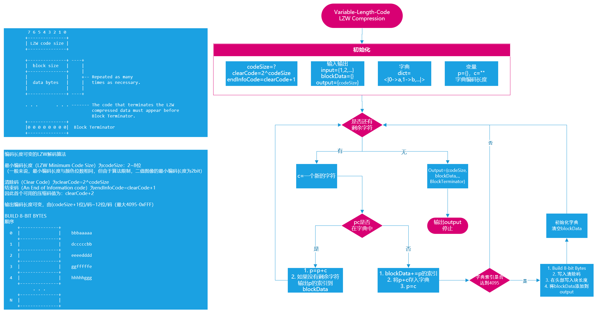
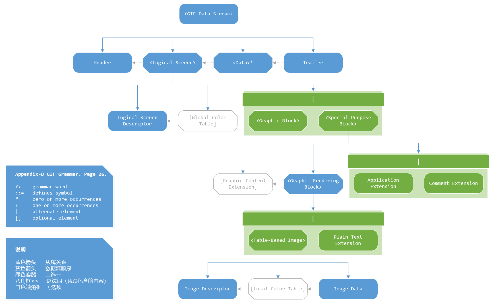
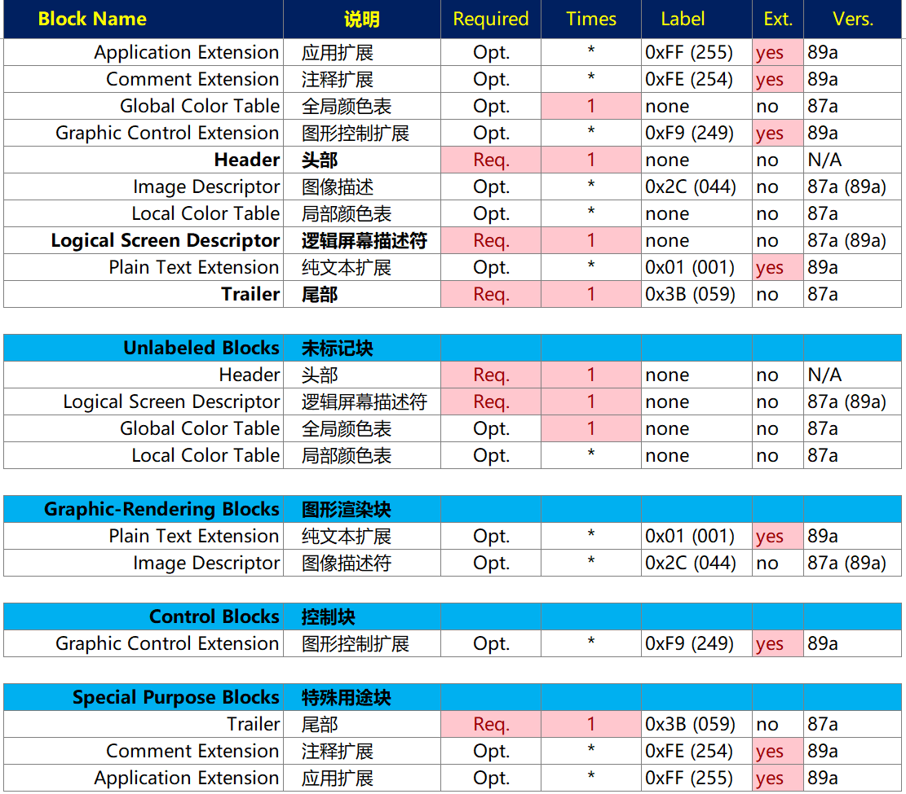
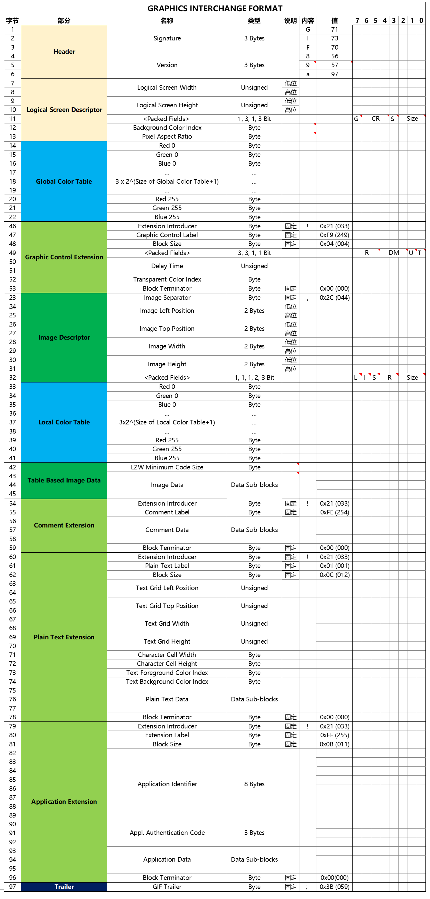

# GIF图像文件格式-用Mathematica实现编码过程

## 1. 介绍

### 1.0 闲话

对于一些每帧只有一小部分有变化的GIF动图来说，Mathematica导出GIF图像时，每帧都使用了整幅图像，而不是仅发生变化的部分。对于这种情况，直接使用Mathematica导出的GIF图像文件占用空间会比较大。

而在GIF编码协议中，每帧可以是不大于整个图像尺寸的任意大小的图像，而且可以指定其位置，这就给解决上面的问题提供了一个有效的方法。

于是为了解决该问题，我看了几遍[《GRAPHICS INTERCHANGE FORMAT(sm) Version 89a》](https://www.w3.org/Graphics/GIF/spec-gif89a.txt)，也查了一些资料，最后终于用Mathematica实现了GIF的编码，这样就可以大大缩小每帧只有一小部分有变化的GIF动图文件占用的空间了。

本文主要介绍GIF编码协议的逻辑和流程。

Mathematica程序可在GitHub上下载：。

### 1.1 GIF 介绍

图像互换格式（GIF，Graphics Interchange Format）是一种位图图形文件格式，以8位色（即256种颜色）重现真彩色的图像。它实际上是一种压缩文档，采用LZW压缩算法进行编码，有效地减少了图像文件在网络上传输的时间。它是当前万维网广泛应用的网络传输图像格式之一。

图像互换格式格式的原始版本叫做87a。1989年，CompuServe发布了一个名为89a的增强版本，在这个版本中，为图像互换格式文档扩充了图形控制区块、备注、说明、应用程序接口等四个区块，并提供了对透明色和多帧动画的支持。现在我们一般所说的GIF动画都是指89a的格式。

随着1995年9月的Netscape Navigator 2.0发布，Netscape定义了一个GIF格式的应用程序扩展，它定义了一个动画应该循环多少次或是否应该无限次地播放，这导致了动画GIF的兴起。

2015年5月，Facebook添加了GIF支持，尽管他们最初不支持在他们的网站上使用GIF。

### 1.2 LZW压缩技术介绍

Lempel-Ziv-Welch（缩写LZW），是亚伯拉罕·蓝波、杰可布·立夫与泰瑞·卫曲共同提出的一种无损数据压缩算法。

该算法的优点在于其只需存储一个相当小的表格，就可以存储数据还原时相对应的值，所以所需成本相对地低；然而，这种算法的设计着重在实现的速度，由于它并没有对数据做任何分析，所以并不一定是最好的算法。

GIF文件中使用的是可变长的LZW算法，即存储时使用的位长是可变的。

## 2. 可变长 LZW 压缩算法

### 2.1 参考

- 维基百科：[Lempel–Ziv–Welch（en）](https://en.wikipedia.org/wiki/Lempel%E2%80%93Ziv%E2%80%93Welch)
- 维基百科：[LZW（zh）](https://zh.wikipedia.org/wiki/LZW)
- [LZW and GIF explained](https://www.eecis.udel.edu/~amer/CISC651/lzw.and.gif.explained.html)

### 2.2 可变长 LZW 压缩算法

## 3. GIF 文件结构

### 3.1 参考

- [《GRAPHICS INTERCHANGE FORMAT(sm) Version 89a》](https://www.w3.org/Graphics/GIF/spec-gif89a.txt)
- 维基百科：[GIF (en)](https://en.wikipedia.org/wiki/GIF)
- 维基百科：[GIF (zh)](https://zh.wikipedia.org/wiki/GIF)

### 3.2 GIF 文件结构

根据[《GRAPHICS INTERCHANGE FORMAT(sm) Version 89a》](https://www.w3.org/Graphics/GIF/spec-gif89a.txt)，整理得到如下GIF文件格式结构简图：

其中语法词如下：

文件数据流如下：

