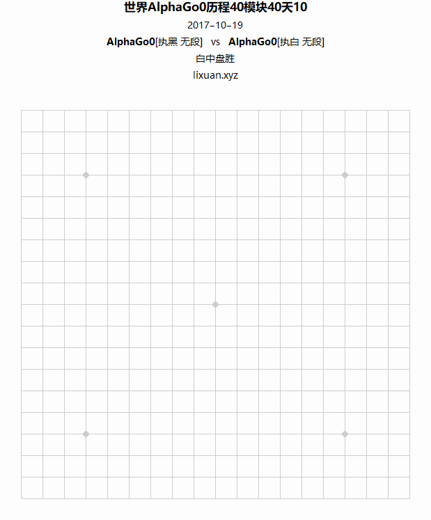
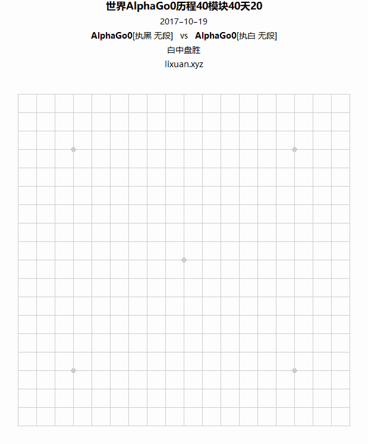

## 介绍

相关文章参见：

- [GIF图像文件格式-用Mathematica实现编码过程](https://lixuan.xyz/blog/2019-10-29/2276.html)
- [GIF图像文件格式-用于展示围棋谱](https://lixuan.xyz/blog/2019-11-08/2292.html)

接前一篇《[GIF图像文件格式-用Mathematica实现编码过程](https://lixuan.xyz/blog/2019-10-29/2276.html)》，其对围棋谱的可视化非常合适：相比于直接使用Mathematica导出的GIF，该程序可以节省很大的空间。

关于程序请参见： https://github.com/SqRoots/gifor/tree/master/usage-of-playing-go-chess
下载后，打开“gifor/usage-of-playing-go-chess/demo.nb”，可以进行测试。

## 实例

为此我还从新浪围棋采集了大量SGF围棋棋谱，而且每天仍在继续采集，截止到20191108，已经采集了 51845 份。
下面是部分关于AlphaGo棋谱的例子（压缩对比，动图）：

| **文件名**                                      | **帧数** | **压缩后文件大小** | **直接导出文件大小** | **压缩比** |
| ----------------------------------------------- | -------- | ------------------ | -------------------- | ---------- |
| go-chess-世界AlphaGo0历程40模块40天01-41341.gif | 1252帧   | 0.28MB             | 49.52MB              | 0.57%      |
| go-chess-世界AlphaGo0历程40模块40天02-41340.gif | 617帧    | 0.16MB             | 19.31MB              | 0.83%      |
| go-chess-世界AlphaGo0历程40模块40天03-41339.gif | 347帧    | 0.09MB             | 8.61MB               | 1.05%      |
| go-chess-世界AlphaGo0历程40模块40天04-41338.gif | 484帧    | 0.12MB             | 13.56MB              | 0.88%      |
| go-chess-世界AlphaGo0历程40模块40天05-41337.gif | 523帧    | 0.13MB             | 15.01MB              | 0.87%      |
| go-chess-世界AlphaGo0历程40模块40天06-41336.gif | 713帧    | 0.17MB             | 22.86MB              | 0.74%      |
| go-chess-世界AlphaGo0历程40模块40天07-41335.gif | 550帧    | 0.14MB             | 16.32MB              | 0.86%      |
| go-chess-世界AlphaGo0历程40模块40天08-41334.gif | 468帧    | 0.12MB             | 13.17MB              | 0.91%      |
| go-chess-世界AlphaGo0历程40模块40天09-41333.gif | 517帧    | 0.13MB             | 15.09MB              | 0.86%      |
| go-chess-世界AlphaGo0历程40模块40天10-41332.gif | 453帧    | 0.12MB             | 12.22MB              | 0.98%      |
| go-chess-世界AlphaGo0历程40模块40天11-41331.gif | 502帧    | 0.13MB             | 14.39MB              | 0.90%      |
| go-chess-世界AlphaGo0历程40模块40天12-41330.gif | 605帧    | 0.15MB             | 18.55MB              | 0.81%      |
| go-chess-世界AlphaGo0历程40模块40天13-41329.gif | 518帧    | 0.13MB             | 15.08MB              | 0.86%      |
| go-chess-世界AlphaGo0历程40模块40天14-41328.gif | 305帧    | 0.08MB             | 7.21MB               | 1.11%      |
| go-chess-世界AlphaGo0历程40模块40天15-41327.gif | 450帧    | 0.12MB             | 12.3MB               | 0.98%      |
| go-chess-世界AlphaGo0历程40模块40天16-41326.gif | 537帧    | 0.13MB             | 15.58MB              | 0.83%      |
| go-chess-世界AlphaGo0历程40模块40天17-41325.gif | 710帧    | 0.17MB             | 22.85MB              | 0.74%      |
| go-chess-世界AlphaGo0历程40模块40天18-41324.gif | 505帧    | 0.13MB             | 14.68MB              | 0.89%      |
| go-chess-世界AlphaGo0历程40模块40天19-41323.gif | 522帧    | 0.13MB             | 15.07MB              | 0.86%      |
| go-chess-世界AlphaGo0历程40模块40天20-41322.gif | 445帧    | 0.12MB             | 12.19MB              | 0.98%      |

- 
- 